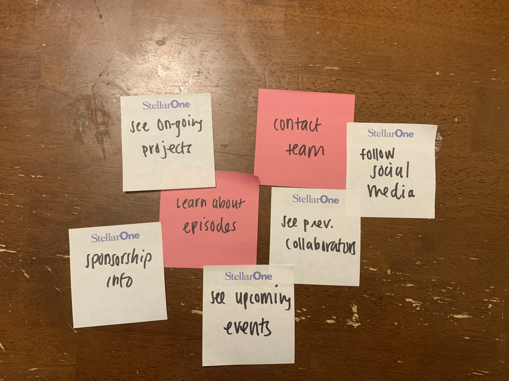

# Project 1: Design Journey

Be clear and concise in your writing. Bullets points are encouraged.

**Everything, including images, must be visible in Markdown Preview.** If it's not visible in Markdown Preview, then we won't grade it. We won't give you partial credit either. This is your warning.

## Existing Design, Planning, & Refined Design (Milestone 1)

### Existing Site: Target Audience I (Milestone 1)
> Who is your _existing_ site's target audience?
My existing site's target audience is members of the Cornell community who are listeners of podcasts and interested in podcasting. They will find helpful content from the site, such as podcast workshops or information about how to join the production team.

### Existing Site: Target Audience I Needs (Milestone 1)
> Document your existing site's target audience's needs.
> List each need below. There is no specific number of needs required for this, but you need enough to do the job.

- Need #1: Information about accessing recording studio
  - **Need**
    - > What does your existing target audience need?
    Audience needs to have accessible information regarding how to access and use the recording studio
  - **Design Choices**
    - > How does your existing site meet this need?
    information to address potential questions is displayed visibly in the home page for ease and accessibility, along with pictures of the studio
- Need #2: Read Episode Notes
  - **Need**
    - > What does your existing target audience need?
    Audience member needs way to read about latest episodes and citation notes
  - **Design Choices**
    - > How does your existing site meet this need?
    There is a separate page dedicated to episodes, where audience members can read the episode notes complementing each audio file along with seeing an episode cover art as a visual representation of what they can listen to
- Need #3: Leadership information
  - **Need**
    - > What does your existing target audience need?
    - Learn about the existing leadership team and who to contact with questions
  - **Design Choices**
    - > How does your existing site meet this need?
    Audience members can navigate to the Meet the Team page to learn more about who is currently on the production team, so they feel more comfortable approaching them with additional org related questions
- Need #4: New member training process
  - **Need**
    - > What does your existing target audience need?
    Learn about how to join the team and the onboarding (new member training) process
  - **Design Choices**
    - > How does your existing site meet this need?
    Interested members are able to get in touch with the production team through several avenues, all of which are displayed on the contact us page. There are multiple social media links as well as a dedicated form for such inquiries


### Existing Site: Design/Sketches (Milestone 1)
> Sketch your existing site. Include these sketches here.
> DO NOT COPY SKETCHES FROM THE ORIGINAL ASSIGNMENT! Create new sketches here. This is part of the design process to get you thinking about the strengths/weaknesses of the current design.
> Provide a brief explanation _underneath_ each sketch.


Home page of the site, displays the production group's banner as well as navigation bar and sources to listen to podcast. Additionally, also has images for the recording studio and information regarding access


The team page serves as the "about us" page that displays images and information about the club members so that prospective members feel more comfortable reaching out to them.


Listeners and potential members can listen to the podcast here and read more about each episode in the complementary notes


The contact page allows audience members to have an easy way to get in touch with the organization


### Refined Site: Target Audience II (Milestone 1)
> Who is your additional/secondary target audience?
The secondary target audience are collaborators looking to work with the team in some capacity. This can include other media groups or individuals who want to be featured on the podcast. Other collaborators can also include companies and organizations who want to sponsor SOTP in exchange for hosting ads on episodes.


### Refined Site: Target Audience II Needs (Milestone 1)
> Document target audience II's needs.
> List each need below. There is no specific number of needs required for this, but you need enough to do the job.

- Need #1: Learn about collaboration opportunities
  - **Need**
    - > What does your target audience II need?
    Target audience II needs to learn about ways to work with the podcast group, and the existing projects that members are working on
  - **Design Ideas and Choices**
    - > How will you refine your site's design to meet this need?
    Site will include an ongoing project page that features future portfolio activities to allow potential collaborators (target audience II) a better understanding of the scope of the org
- Need #2: Sponsor team
  - **Need**
    - > What does your target audience II need?
    Target audience II needs information on how to sponsor team and the different price points and benefits awarded to the sponsor
  - **Design Ideas and Choices**
    - > How will you refine your site's design to meet this need?
    There will be a comprehensive sponsorship tiers infographic to convey the benefits awarded at each price point
- Need #3: Contact team
  - **Need**
    - > What does your target audience II need?
    Target audience II needs a direct line of access to communicate their ideas or propositions to the team, and allow this audience to propose new aspects of collaboration not previously covered
  - **Design Ideas and Choices**
    - > How will you refine your site's design to meet this need?
    There will be a primer question that will allow user to select if they are interested in joining team or sponsorship opportunity, thus serving the communication needs for both target audience I and II


### Refined Site: Content Organization/Navigation (Milestone 1)
> Identify the content that is necessary for both target audiences.
> List the content here.
> Don't forget to include the form.

- Recording studio information
- State of the Pod production members
- Contact form (for both audiences)
- state of the pod educational curriculum
- Podcast episodes and notes
- Ongoing projects


> Organize the content for the target audience and identify possible pages for the content using card sorting.
> First, organize the content for target audience I. Document your card sorting by taking a photo and including it here.


> Second, organize the content for target audience II. Document your card sorting by taking a photo and including it here.



> Next, organize the content for both target audiences. Document your card sorting by taking a photo and including it here.


> Lastly, list the pages that resulted from your final card sort (i.e. your site's navigation).

- Home
- About the Team
- Episodes
- Contact Us
- Partnerships


### Refined Site: Design (Milestone 1)
> Refine the design of your site to meet the needs of _both_ target audiences.
> Include sketches of each page of the refined design.
> Provide a brief explanation _underneath_ each sketch.
> Document your _entire_ design process. **Show your preliminary sketches and your final sketches.**
> Don't forget the form and confirmation page!

Preliminary sketches

The home page of the website


The episode page where all podcast episodes will be hosted, along with their complementary episode notes


Page specifically dedicated to partnership opportunities and previous collaborations, providing ease of navigation for target audience II


![Contact form design iterations] (contact-form1.PNG)
![Contact form design iterations] (contact-form2.PNG)


Final sketches

The final design home page of the website


The episode page where all podcast episodes will be hosted, along with their complementary episode notes


Page specifically dedicated to partnership opportunities and previous collaborations, providing ease of navigation for target audience II


![Contact form final design iterations] (contact-form1.PNG)
![Contact form final design iterations] (contact-form2.PNG)


### Partial Plan (Milestone 1)
> Using your refined sketches, plan your site's partials.
> You may describe each partial or sketch it. It's up to you!

There will be a navigation partial for the nav bar to be displayed on each page
In addition, there will also be a footer that will link the user to the group's various social media, including Twitter, Instagram, Facebook.

first partial is for nav bar
second partial is for footer with social media links
---

## Sticky Form Planning (Milestone 2)

### Sticky Form (Milestone 2)
> What controls do you need for your form?
Name, email, year, top three favorite podcasts (separated by commas), episode pitch

> Plan out your feedback messages for your form. You may sketch (probably the easiest) or write it out.
Please
!(Contact Sticky Form)[sticky-form.PNG]

> How does this form meet the needs of at least one of your target audiences (specify which)?
This form meets the needs of the first target audience, which are potential students interested in learning how to produce podcasts and join the production team. The form will serve as a source of contact for them and also begin the process of developing a unique idea with the help of the production team.

### Validation Code Plan (Milestone 2)
> Write out your pseudocode plan for handling the validation of the form.

```
WRITE YOUR PSEUDOCODE HERE

if name field is empty, form is not valid and name feedback is set to True

if email field is not valid email address, form is set to invalid and email feedback set to TRUE

if none of radio buttons for team interest is selected, form is set to invalid and class year feedback set to TRUE
```

---

## Complete & Polished Website (Final Submission)

### Target Audiences (Final Submission)
> Tell us how your final site meets the needs of the target audiences. Be specific here. Tell us how you tailored your design, content, etc. to make your website usable by both target audiences.
The drop down menu for the first question after the identification questions was about purpose for contacting team. This helps the team distinguish the two primary target audiences apart from each other, and also more importantly allows the audience to recognize that their purpose for contacting the team is recognized and accounted for. An additional not applicable area for the question regarding interest on team allows for the second target audience to indicate their interests are separate from the first target audience. In addition, not making the final question of the episode pitch required demonstrates that it is more aligned with the needs of one audience, and recognizes that the connection form is meant to serve two different audiences.

### Additional Design Justifications (Final Submission)
> If you feel like you haven’t fully explained your design choices in the final submission, or you want to explain some functions in your site (e.g., if you feel like you make a special design choice which might not meet the final requirement), you can use the additional design justifications to justify your design choices. Remember, this is place for you to justify your design choices which you haven’t covered in the design journey. You don’t need to fill out this section if you think all design choices have been well explained in the design journey.


### Self-Reflection (Final Submission)
> Reflect on what you learned during this assignment. How have you improved from 1300? What things did you have trouble with?

I learned of a much easier way to test whether any of the radio buttons have been selected, as well as the purpose behind each component of a form control. This was building off of my prior 1300 knowledge, but greater opportunities to complete more challenging tasks helped me explore new concepts I previosuly was rusty on. In addition, I felt that my grasp of stylistic aspects of web design has also improved, because I have greater understanding of the different options at my disposal for formatting. When I'm de-bugging the code, I also have noticed a better intuition for sources of potential error, which has helped me catch the issues faster.
